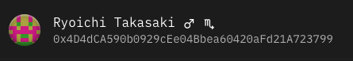

# go-persona

Returns a base persona (name, sex & zodiac) for a given ethereum style address. As an homage to Satoshi Nakamoto, all names (both given and family) are of a japanese origin. These are not meant to replace ENS names, but as security/convenience to allow the user to more easily check if an address he wants to interact with is the correct one.

_Suggested usage is as a fallback when an account does not have an ENS._



## Use

```go
  p := persona.New(address)
```

Returns a struct of type Persona defined as

```go
type Persona struct {
  Name string `bson:"name" json:"name"`
  Sex string `bson:"sex" json:"sex"`
  Zodiac string `bson:"zodiac" json:"zodiac"`
}
```

E.g.

```
  p := persona.New("0x4D4dCA590b0929cEe04Bbea60420aFd21A723799")
```

Returns

```
  Persona{
    Name: "Ryoichi Takasaki",
    Sex: "male",
    Zodiac: "scorpio"
  }
```

## License

[WTFPL](http://www.wtfpl.net/)
